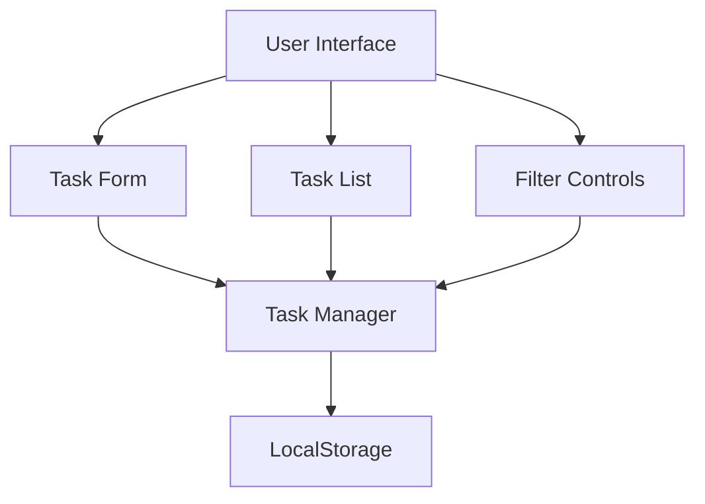
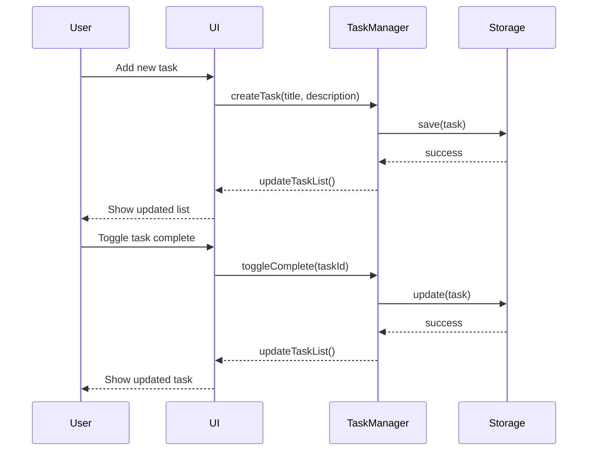

# Session 2: Building a To-Do List App with AI Assistance

## Session Overview

**Objectives**: 
- Create a simple to-do list application using AI assistance
- Demonstrate AI-enhanced development workflows
- Introduce practical tools for each phase of development
- Reinforce system thinking and architecture principles


### 1. Outlining Requirements with AI Assistance (25 minutes)

**Tools**: VSCode for Markdown, Mermaid diagrams

**Demonstration**:
- Show participants how to create a requirements document in Markdown
- Use AI to help expand initial requirements into detailed specifications
- Demonstrate creating Mermaid diagrams with AI assistance:
  - User flow diagram
  - Component relationship diagram
  - Data model diagram

### 2. Creating a Skeletal Outline (35 minutes)

**Tools**: VSCode, GitHub Copilot

**Demonstration**:
- Show how to create the initial project structure
- Demonstrate using GitHub Copilot to generate:
  - Basic HTML structure for the UI
  - CSS styling for the to-do list
  - JavaScript functionality for adding/removing tasks
  - Data persistence using localStorage

### 3. Testing the Application (25 minutes)

**Tools**: Node.js, Jest

**Demonstration**:
- Show how to set up Jest for testing JavaScript code
- Use AI to generate test cases for the to-do app functionality
- Demonstrate fixing errors and issues identified by tests
- Show how to measure code coverage

### 4. Containerizing the Application (20 minutes)

**Tools**: Docker

**Demonstration**:
- Show how to create a Dockerfile with AI assistance
- Demonstrate building and running the containerized application
- Explain key Docker concepts as they appear in the configuration
- Show how to debug common issues


### 5. Wrap-up and Next Steps (5 minutes)

**Take-Home Activities**:
1. Extend the to-do application with additional features
2. Experiment with different AI prompting techniques
3. Try implementing the same application with different approaches
4. Document lessons learned in the shared repository

**Preview of Next Session**:
- Building on our to-do application
- Implementing more advanced features
- Connecting to backend services
- Advanced testing strategies

## Sample Requirements Document

```markdown
# To-Do List Application Requirements

## Overview
A simple to-do list web application that allows users to create, manage, and organize tasks.

## Functional Requirements

1. Task Management
   - Create new tasks with a title and optional description
   - Mark tasks as complete/incomplete
   - Edit existing tasks
   - Delete tasks
   - Filter tasks by status (all, active, completed)

2. User Interface
   - Clean, intuitive interface
   - Responsive design for mobile and desktop
   - Visual distinction between complete and incomplete tasks
   - Drag-and-drop reordering of tasks

3. Data Persistence
   - Store tasks in browser localStorage
   - Persist task status across page refreshes/reopens

## Non-Functional Requirements

1. Performance
   - App should load in under 3 seconds
   - UI operations should feel instantaneous

2. Usability
   - Accessible to keyboard-only users
   - Works across modern browsers (Chrome, Firefox, Safari, Edge)

3. Technical Constraints
   - Vanilla JavaScript (no frameworks)
   - CSS for styling (no UI libraries)
   - HTML5 semantic elements

## Future Considerations (out of scope for initial version)
- User accounts and authentication
- Cloud synchronization
- Due dates and reminders
- Categories/tags for tasks
```

## Sample Mermaid Diagrams

### Component Diagram



### Data Flow Diagram



## Instructor Notes

### Techniques for Effective GitHub Copilot Usage

1. **Be specific with comments**:
   - Write detailed comments explaining what you want the code to do
   - Include expected inputs/outputs, edge cases, and constraints
   - Example: `// Create a function that adds a new task to the list, taking a task title and optional description, returning the new task object with a unique ID`

2. **Seed with structure**:
   - Start functions with parameter definitions
   - Create empty class/object structures
   - Define expected return types
   - Example: `function addTask(title, description = '') {`

3. **Iterative refinement**:
   - Accept initial suggestions, then modify
   - Add comments for specific improvements
   - Build upon generated code incrementally

4. **Control generation scope**:
   - Generate smaller chunks rather than entire files
   - Focus on specific functions or components
   - Review and modify before continuing

### Common Challenges and Solutions

1. **Overly complex suggestions**:
   - Solution: Add comments specifying simplicity requirements
   - Example: `// Simple implementation using only vanilla JS`

2. **Misaligned architecture**:
   - Solution: Define clear structure first with comments or skeleton code
   - Example: Create empty functions/classes before filling details

3. **Testing edge cases**:
   - Solution: Explicitly request tests for edge cases
   - Example: `// Test handling of empty task titles`

4. **Docker configuration issues**:
   - Solution: Specify exact requirements in comments
   - Example: `# Dockerfile for a simple static HTML/JS/CSS site served via nginx`

## Recording and Transcript
The recording of this session can be accessed [here](https://drive.google.com/file/d/1QBlfSF_PCzlZX7zn7_6cc2uUg9fgDfCh) and the transcripts are available [here](https://docs.google.com/document/d/15FvF0odSi0t21cV1aKC-mt0Z_laCHq46KqAJM-v2918)
